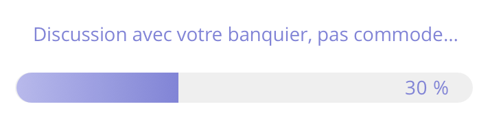

# WeatherApp

WeatherApp is a technical assessment for Exomind.

## Subject

The assessment was given as follow:

_Créer une application qui :_

    _1. Affiche un écran d’accueil avec un texte et un bouton._

    _2. Au clic sur le bouton, j’arrive sur un autre écran contenant une jauge de progression en pourcentage en bas de l’écran avec un message au-dessus._

_Par exemple :_

    _1․ Cette jauge doit se remplir à 100% en 60 secondes_

    _2․ Toutes les 10 secondes elle doit faire un appel à une API météo pour 5 villes :_

_0 secondes Rennes, à 10 secondes Paris, à 20 secondes Nantes, etc pour Bordeaux et Lyon_

_(par exemple l’api https://openweathermap.org/current, ou une autre API de météo de votre choix)_

    _1․ Un message d’attente est affiché pour faire patienter l’utilisateur_

_3 messages qui doivent tourner toutes les 6 secondes (sans limite de temps)_

_1.    Nous téléchargeons les données…_

_2.    C’est presque fini…_

_3.    Plus que quelques secondes avant d’avoir le résultat…_

    _1. Gérer les erreurs d’API_

    _2. Lorsque la jauge est remplie elle affiche les résultats obtenus sous forme d’un tableau de 5 lignes (une ligne par ville) sur le même écran (au-dessus de la jauge par exemple)_

    _• Afficher à minima le nom de la ville, la température, la couverture nuageuse (sous forme d’un picto par exemple)_

    _1. La jauge se transforme en bouton « Recommencer »_

    _2. Il est possible de faire back pour revenir à l’écran d’accueil_

_Afin de nous faire un retour rapide, vous êtes libre de prendre des raccourcis. **Merci dans ce cas de signaler ces raccourcis en commentaire dans votre code**. Ceci afin pour nous d’identifier une volonté d’être rapide par rapport à un manque de rigueur._

### Requirements

From that subject the following requirements can be deduce:
* Navigate between 2 pages (from the Home to the Weather page)
* Display a Home screen with 1 text and 1 button
* Display a Weather screen with weather information of 5 cities (Rennes, Paris, Nantes, Bordeaux and Lyon)
* Display a progress bar which filled in 60 seconds
* Display a loading message at the bottom of the page which change the text every 6 seconds and alternate between the 3 following messages: `Nous téléchargeons les données…`,`C’est presque fini…` or `Plus que quelques secondes avant d’avoir le résultat…` 
* Display a list of cities which contains: the name, the temperature and the cloud coverage
* Have a button with the text `Recommencer` at the bottom of the page to restart the process 
* Handle back press
* Handle API errors

## Architecture

### Domain

This package contains all business classes. You usually have repositories interfaces and models.

### Data

This package contains all implementation for the Domain package.

### Presentation

This package contains all UI elements for the app.

## Coding conventions

This repository uses the CoCo rule:
* Respect the **Co**nventions of the language (See [Kotlin Coding Conventions](https://kotlinlang.org/docs/coding-conventions.html))
* Respect the **Co**herence inside the project (Keep the same architecture throughout all the source code)

## Dependencies

* [Material Components](https://github.com/material-components/material-components-android) for UI elements
* [Coil](https://coil-kt.github.io/coil/) to load async images

